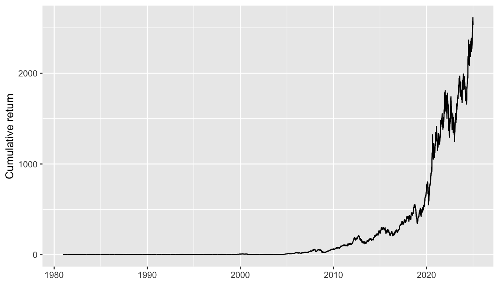

# Data Management for Research

``` r

library(db2pq)
```

This article adapts a broader set of data-management ideas for the
narrower task that `db2pq` is designed to support: building and
maintaining a local Parquet repository from WRDS or another PostgreSQL
database.

The goal is to separate three concerns that often get mixed together in
research code:

1.  Getting data from the source system.
2.  Storing a reusable local copy in an efficient format.
3.  Running analysis code against that local copy.

`db2pq` focuses on the first two steps. Analysis code can then use
packages such as `arrow`, `duckdb`, `dplyr`, or `polars` to work with
the Parquet files.

## Principles

Good research data management is mostly about making later work boring:
scripts should be rerunnable, file locations should be predictable, and
it should be clear which files came from an external source and which
files were created by project code.

Several principles are useful:

1.  Keep source data immutable where practical.
2.  Make derived data reproducible from code.
3.  Use stable, documented file locations.
4.  Record enough metadata to know when a file was created and what
    source it represents.
5.  Avoid putting large, private, or licensed data files in Git.

`db2pq` is not a full project-management framework. It supplies a narrow
piece of infrastructure: a repeatable way to create local Parquet copies
of database tables and to inspect the metadata attached to those copies.

## Prefer Portable File Formats

Research data often outlives the first tool used to analyze it. Parquet
is a useful storage format because it is columnar, compressed, typed,
and readable from many systems. A local Parquet repository can be
queried from R, Python, DuckDB, Arrow, Spark, and other tools without
repeatedly connecting to WRDS.

This is especially useful when a project uses more than one language. A
refresh script can use `db2pq` to create files, while later analysis can
read the same files from R or Python.

## Use a Stable Data Directory

Set `DATA_DIR` once per project or machine so that scripts can refer to
a logical data repository without hard-coding paths throughout the
analysis.

``` r

Sys.setenv(DATA_DIR = "~/Dropbox/pq_data")
```

Files created by `db2pq` are stored using the layout:

``` text
<DATA_DIR>/<schema>/<table>.parquet
```

For example:

``` text
~/Dropbox/pq_data/crsp/dsi.parquet
~/Dropbox/pq_data/comp/company.parquet
```

## Treat Downloads as a Refresh Step

The scripts that download data should usually be separate from the
scripts that analyze data. A refresh script might contain calls like
these:

``` r

library(db2pq)

wrds_update_pq("dsi", "crsp")
wrds_update_pq("company", "comp")
wrds_update_pq("funda", "comp", keep = c("gvkey", "datadate", "at", "sale"))
```

Because
[`wrds_update_pq()`](https://iangow.github.io/db2pqr/reference/wrds_update_pq.md)
compares WRDS metadata with metadata embedded in the local Parquet file,
it can be rerun without downloading a table that is already current.

The same idea applies to non-WRDS PostgreSQL sources. Put source-system
refresh logic in one place, then let analysis code consume the resulting
files.

## Keep Raw and Derived Data Separate

A useful convention is to keep source-table exports in one repository
and write derived research datasets somewhere else. For example:

``` text
~/Dropbox/pq_data/          # Local source-table repository
data/derived/               # Project-specific derived files
```

The source-table repository should be reproducible from WRDS or
PostgreSQL. Derived files should be reproducible from project code.

This separation matters because source data and derived data have
different rules. Source exports should be refreshed deliberately and
should preserve the database table as closely as is useful. Derived
files can be redesigned as the research design changes.

## Make Transformations Explicit

Avoid hiding important filters, joins, and sample restrictions inside ad
hoc interactive work. Put them in scripts or functions. A useful pattern
is:

``` text
source database -> local Parquet repository -> derived research data -> tables/figures
```

`db2pq` can help with the first arrow. The later arrows should usually
live in project-specific code, where sample construction choices are
visible to readers and coauthors.

## Record Metadata

Parquet files written by WRDS helpers include `last_modified` metadata
when the source table provides it. Use
[`pq_last_modified()`](https://iangow.github.io/db2pqr/reference/pq_last_modified.md)
to audit a repository:

``` r

pq_last_modified(schema = "crsp")
pq_last_modified(schema = "comp")
```

For data-management work, this is often more useful than relying only on
local file modification times, because the metadata records what `db2pq`
knows about the source table.

Metadata will not answer every provenance question, but it gives a
lightweight audit trail. For more complex projects, combine it with
project logs, scripts, or a data dictionary that records table sources
and refresh dates.

When this article is rendered with access to a local Parquet repository,
the following chunk shows the embedded source metadata for a real
WRDS-derived file.

``` r

Sys.getenv("DATA_DIR")
#> [1] "/Users/igow/Dropbox/pq_data"
pq_last_modified(table_name = "dsi", schema = "crsp")
#> [1] "Stock - Market Indexes Daily NYSE/AMEX/NASDAQ/ARCA (Updated 2025-02-08)"
```

## Archive Before Replacing

For tables where changes matter, use `archive = TRUE` so an existing
file is moved aside before it is replaced:

``` r

wrds_update_pq("company", "comp", archive = TRUE)
pq_last_modified("company", "comp", archive = TRUE)
```

Archives are stored under:

``` text
<DATA_DIR>/<schema>/archive/
```

This gives you a simple local history without turning the data
repository into a Git repository.

Archiving is most useful for relatively small reference tables or for
cases where source revisions may affect published results. For very
large tables, keeping every historical copy may be too expensive; in
those cases, record the refresh date and source metadata instead.

To make the archive mechanics concrete without modifying the main local
data repository, this article copies `comp.company` into a temporary
documentation repository and archives/restores that copy.

``` r

pq_last_modified(table_name = "company", schema = "comp", data_dir = doc_data_dir)
#> [1] ""
```

Archiving moves the active file into the schema’s `archive` directory.

``` r

archived_company <- pq_archive("company", "comp", data_dir = doc_data_dir)
basename(archived_company)
#> [1] "company_unknown_modified.parquet"

pq_last_modified(table_name = "company", schema = "comp",
                 data_dir = doc_data_dir, archive = TRUE) |>
  dplyr::select(file_name, last_mod)
#> # A tibble: 1 × 2
#>   file_name                last_mod
#>   <chr>                    <dttm>  
#> 1 company_unknown_modified NA
```

Restoring the archived file makes it the active copy again.

``` r

pq_restore(tools::file_path_sans_ext(basename(archived_company)), "comp",
           data_dir = doc_data_dir, archive = FALSE)

pq_last_modified(table_name = "company", schema = "comp", data_dir = doc_data_dir)
#> [1] ""
```

## Keep Large Data Out of Git

Code, documentation, and small test fixtures belong in Git. Full WRDS
exports generally do not. If a package or project needs example data,
use a small, non-sensitive file and place it deliberately in
`inst/extdata` or another documented location.

For package documentation, build examples so they can run without
private WRDS credentials. Longer examples can be shown with
`eval = FALSE`, while the local rendered website can still refer to
small local Parquet fixtures when those are safe to publish.

## Plan for Collaboration

Shared data workflows should minimize assumptions about one person’s
machine. Use environment variables, relative project paths, and
documented setup steps instead of absolute paths such as
`/Users/name/...`.

For WRDS credentials, prefer setup that each user can reproduce locally:

``` r

Sys.setenv(WRDS_ID = "your_wrds_id")
wrds_check_credentials()
```

Do not store credentials in project scripts. The package helpers are
designed to work with environment variables, `.pgpass`, and the
credential mechanisms used by the `wrds` package.

## Suggested Project Pattern

A compact project structure might look like this:

``` text
analysis-project/
  R/
  scripts/
    refresh-data.R
  data/
    derived/
  reports/
  renv.lock
```

The refresh script owns calls to `db2pq`. Analysis scripts read Parquet
files from `DATA_DIR` and write project-specific outputs to
`data/derived`.

## Live Examples with Local Parquet Files

The examples in this section are designed for the locally rendered
documentation site. They run when `DATA_DIR` points to a Parquet
repository that contains the relevant WRDS-derived files. If those files
are not present, the chunks are skipped.

For example, if your repository contains `crsp.dsf` and
`crsp.stocknames`, you can query the files directly with DuckDB without
importing the full data into R.

``` r

library(DBI)
library(dplyr)
#> 
#> Attaching package: 'dplyr'
#> The following objects are masked from 'package:stats':
#> 
#>     filter, lag
#> The following objects are masked from 'package:base':
#> 
#>     intersect, setdiff, setequal, union
library(dbplyr)
#> 
#> Attaching package: 'dbplyr'
#> The following objects are masked from 'package:dplyr':
#> 
#>     ident, sql
library(ggplot2)

db <- dbConnect(duckdb::duckdb())

parquet_tbl <- function(con, schema, table) {
  path <- normalizePath(pq_path(schema, table), winslash = "/", mustWork = TRUE)
  view <- paste(schema, table, sep = "_")
  DBI::dbExecute(
    con,
    paste0("CREATE OR REPLACE VIEW ", view, " AS SELECT * FROM read_parquet('", path, "')")
  )
  tbl(con, view)
}

dsf <- parquet_tbl(db, "crsp", "dsf")
stocknames <- parquet_tbl(db, "crsp", "stocknames")
```

A first check is simply to count the rows in the daily stock file.

``` r

dsf |>
  count() |>
  collect()
#> # A tibble: 1 × 1
#>           n
#>       <dbl>
#> 1 107663470
```

Because DuckDB can query Parquet files in place, summaries can be
computed without first reading every column into memory.

``` r

dsf |>
  mutate(year = as.integer(strftime(date, "%Y"))) |>
  count(year) |>
  arrange(desc(year)) |>
  collect()
#> # A tibble: 100 × 2
#>     year       n
#>    <int>   <dbl>
#>  1  2024 2400962
#>  2  2023 2353845
#>  3  2022 2390163
#>  4  2021 2187548
#>  5  2020 1948995
#>  6  2019 1912085
#>  7  2018 1869604
#>  8  2017 1827893
#>  9  2016 1828555
#> 10  2015 1820358
#> # ℹ 90 more rows
```

Filtering to one trading day reads only the rows and columns needed for
that query.

``` r

dsf_subset <-
  dsf |>
  filter(date == as.Date("1986-01-07")) |>
  select(permno, date, ret, prc, vol) |>
  collect()

head(dsf_subset)
#> # A tibble: 6 × 5
#>   permno date            ret    prc   vol
#>    <int> <date>        <dbl>  <dbl> <dbl>
#> 1  10000 1986-01-07 NA       -2.56   1000
#> 2  10015 1986-01-07  0        9.88   4400
#> 3  10031 1986-01-07  0       -4.75      0
#> 4  10057 1986-01-07  0.0265  14.5   28900
#> 5  10065 1986-01-07  0.00641 19.6   11300
#> 6  10066 1986-01-07  0.0645  -0.516 22500
```

The same files can be used for a small analysis. Here we identify
Apple’s CRSP `permno` from `stocknames`, then compute a cumulative
return series from `dsf`.

``` r

apple_permno <-
  stocknames |>
  filter(grepl("^APPLE COM", comnam)) |>
  distinct(permno) |>
  collect() |>
  pull(permno) |>
  min()

apple_returns <-
  dsf |>
  filter(permno == apple_permno) |>
  select(permno, date, ret) |>
  arrange(date) |>
  collect() |>
  mutate(cumret = exp(cumsum(log(1 + coalesce(ret, 0)))))

ggplot(apple_returns, aes(x = date, y = cumret)) +
  geom_line() +
  labs(x = NULL, y = "Cumulative return")
```



These examples use a local Parquet repository as the analysis substrate.
The refresh step that creates the files is still separate:

``` r

wrds_update_pq("dsf", "crsp")
wrds_update_pq("stocknames", "crsp")
```

That separation is the main point. `db2pq` handles the
database-to-Parquet refresh; analysis code can then operate against
local, typed, columnar files.
